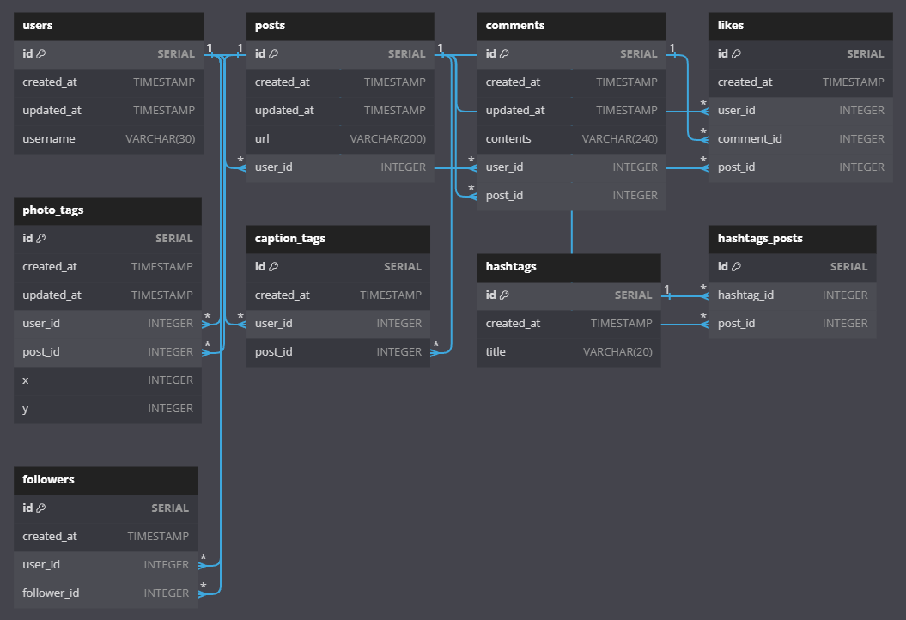

# PostgresSQL and SQL: The Complete Developer's Guide Practice Repo

    
    
    

## Purpose

The purpose of this repository is to have a working file of the exercises and lessons inside of the Udemy course: [SQL and PostgreSQL: The Complete Developer's Guide](https://www.udemy.com/course/sql-and-postgresql/) by Stephen Grider.

## Using this Repo

This repo can be segmented into three parts:

1. The files related to the dummy Instagram database clone, which are:
    - `database_design.dbml` - The database design file for the database which can be recreated using [dbdiagram.io](https://dbdiagram.io/home)
    - `insta_queries.sql` - The queries used to create the database and tables, as well as populate the tables with data
 
 
2. The Javascript files used to practice SQL schema and data migrations, which are:
    - The migration_folder - which contains the files used to practice writing SQL migrations in Javascript
 
 
3. The Javascript files used to create the web server that interfaces with the Instagram clone database, which are:
    - The api folder - which contains the repos, routes, and test files for the database interface
    - The web_server folder - which contains the files used to create the web server that interfaces with the database

## Certificate of Completion

    

